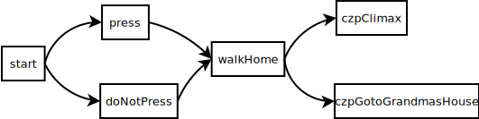

# 3. Section
## 3.1 概述
每个 WTCD 文档都是由若干个 Section 组成的。本章节将会介绍如何定义 section 和互相连接 section。

每一个 Section 都由一个**逻辑块**和任意自然数个**内容块**组成。

比如说，在上一章节给出的例子里就有以下 Sections：

- `start`
- `press`
- `doNotPress`
- `walkHome`
- `czpClimax`
- `czpGotoGrandmasHouse`

这些 Sections 被连接在一起形成如下结构：



## 3.2 Section 逻辑
若要创建一个 Section，**逻辑块**是必不可少的。**逻辑块**决定了当运行到这个 Sections 时在输出正文内容前和输出正文内容后需要做什么。所有的**逻辑块**定义都必须在所有**内容块**之前。

Section 的定义使用如下结构：

```wtcd
section <Section 名字> [先行表达式] [then <后发表达式>]
```

举个例子，给出如下定义：

```wtcd
section example {
  a += 1
then {
  a += 2
}
```

其中 Section 名字是 `example`。其先行表达式为 `{ a += 1 }`，后发表达式为 `{ a += 2 }`。也就是说，当需要进入 `example` 这个 section 时，WTCD 解释器会:

1. 对 `{ a += 1 }` 求值。这个过程会让变量 a 的值加 1。（变量会在下一章节具体介绍）
2. 根据**内容块**的定义输出。（见 3.3）
3. 对 `{ a += 2 }` 求值。这个过程会让变量 a 的值加 2。
4. 根据 `{ a += 2 }` 的返回结果决定接下来怎么做。但是因为 `{ a += 2 }` 没有指定返回值，那么就会采用默认返回值 `null`。在这里，若后发表达式返回值为 `null`，WTCD 就会停止运行。

